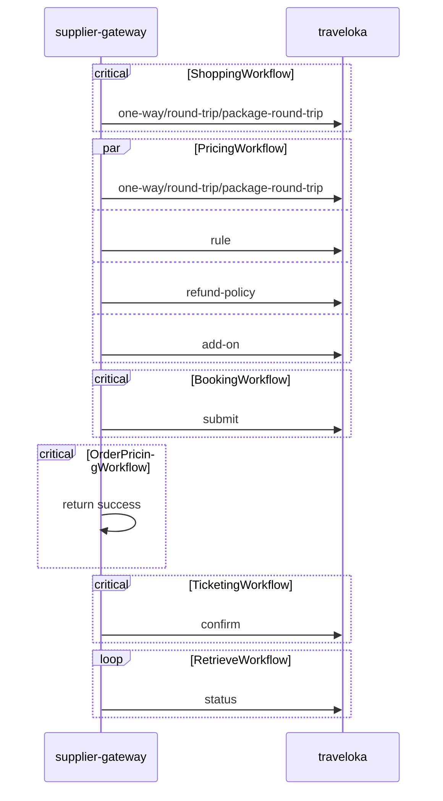
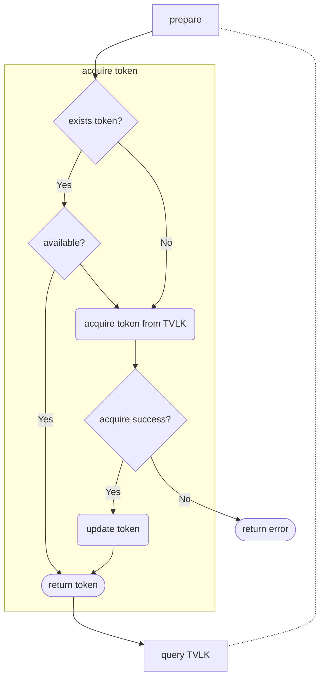

@[toc]

## 0. Traveloka Api List

|key|url|comment|
|---|---|---|
|token|/oauth/accesstoken|acquire access token|
|one-way|/flight/search/one-way|one-way shopping|
|round-trip|/flight/search/round-trip|domestic round-trip shopping|
|package-round-trip|/flight/search/package-round-trip|international round-trip shopping|
|rules|/flight/booking/check-rules|check booking rules|
|refund-policy|/flight/booking/refund-policy|show refund policy|
|add-ons|/flight/booking/add-ons|show add-ons booking|
|submit|/flight/booking/submit|book a journey|
|confirm|/flight/payment/confirm|notice to issue the ticket|
|status|/flight/booking/status|fetch issue result|

## 1. Integration Sequence Diagram

## 2. Workflow Details

2.0 Acquire Tokens

Guarantee there's available token before access traveloka's APIs.

### 2.1 ShoppingWorkflow

Access Logic:

access [one-way](#one-way) api when it is one-way search.

access [roud-trip](#roud-trip) api when it is domestic round trip.

access [package-round-trip](#package-round-trip) api when it is international round trip.

[How to determine one-way/round-trip?]()

[How to determine domestic/international journey?]()

Retry Logic: max 10 times, 2 seconds per retry

Filter Logic:
the interval between outbound arrival time and inbound departure time should be more than 6 hours.

`attentions`: transfer O/D city codes into traveloka's airport codes while access traveloka's api. keep polling until `complete=true`.

### 2.2 PricingWorkflow
Access Logic:

parallel access four APIs below:

    shopping (see 2.1, traveloka doesn't have pricing API, so we use shopping API instead)
    rules
    refund-policy
    add-on

Filt out the corresponding solution according to the input params.Combine rule,refund-policy, add-on into solution. Pass the `flightIds` via `CtShoppingResult.data` .

rules: booking rules, TBC

refund-policy: extract `data.refundPolicies` and follow the guide [How to set miniRules if there are multi rules?]() to set `refundInfoList`.

add-on: extract free baggage only.

### 2.3 BookingWorkflow
Access Logic:

[submit](#submit)

Validation Logic:

lastName/FirstName 2 chars minimium, 20 chars maximium.
total passenger count can not be more than 7 persons.

Others:
return fake PNR. see [How to generate a fake PNR?]()

ticketing time limit should be `paymentExpirationTime` as prefer, or fixed to 120 mins as default.

Guarantee flightIds has already passed from pricing workflow (see 2.2).

### 2.4 OrderPricingWorkflow
Access Logic:

make a stub function call and return success without any supplier API access.

### 2.5 TicketingWorkflow
Access Logic:

[confirm](#confirm)

Validation Logic:
check whether paymentConfirmationStatus = 'OK'

### 2.6 RetrieveWorkflow

Access Logic:

[status](#status)

backfill ticket number.

